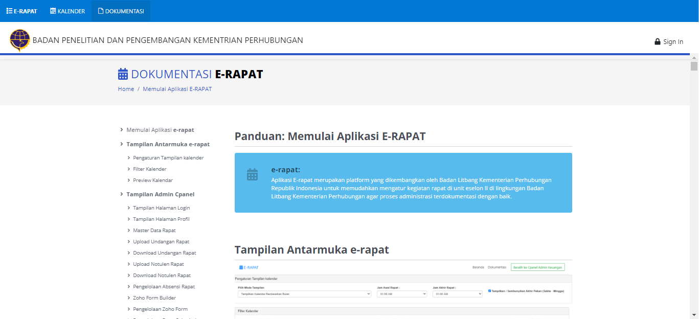
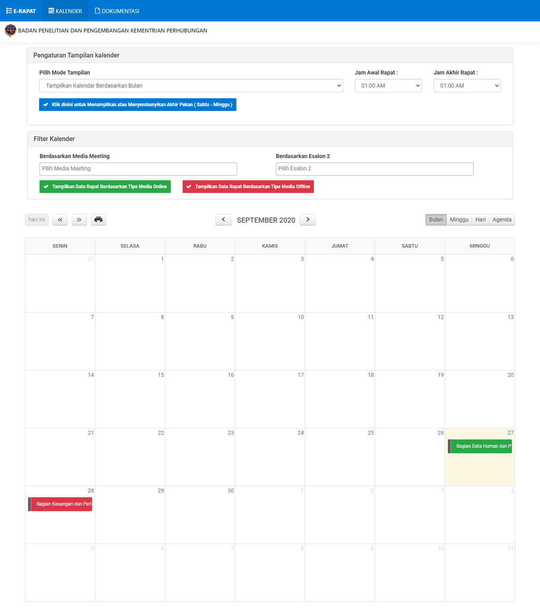
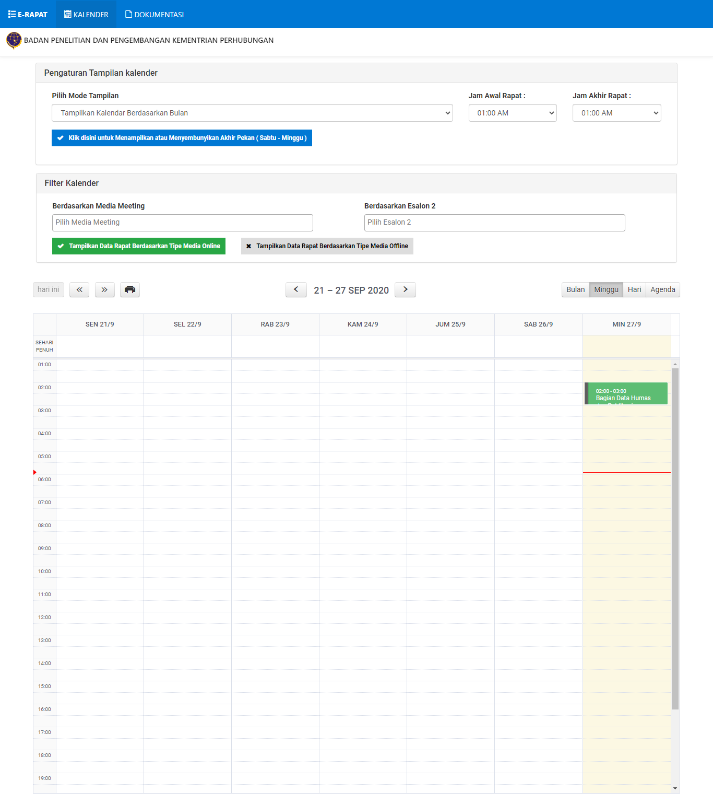
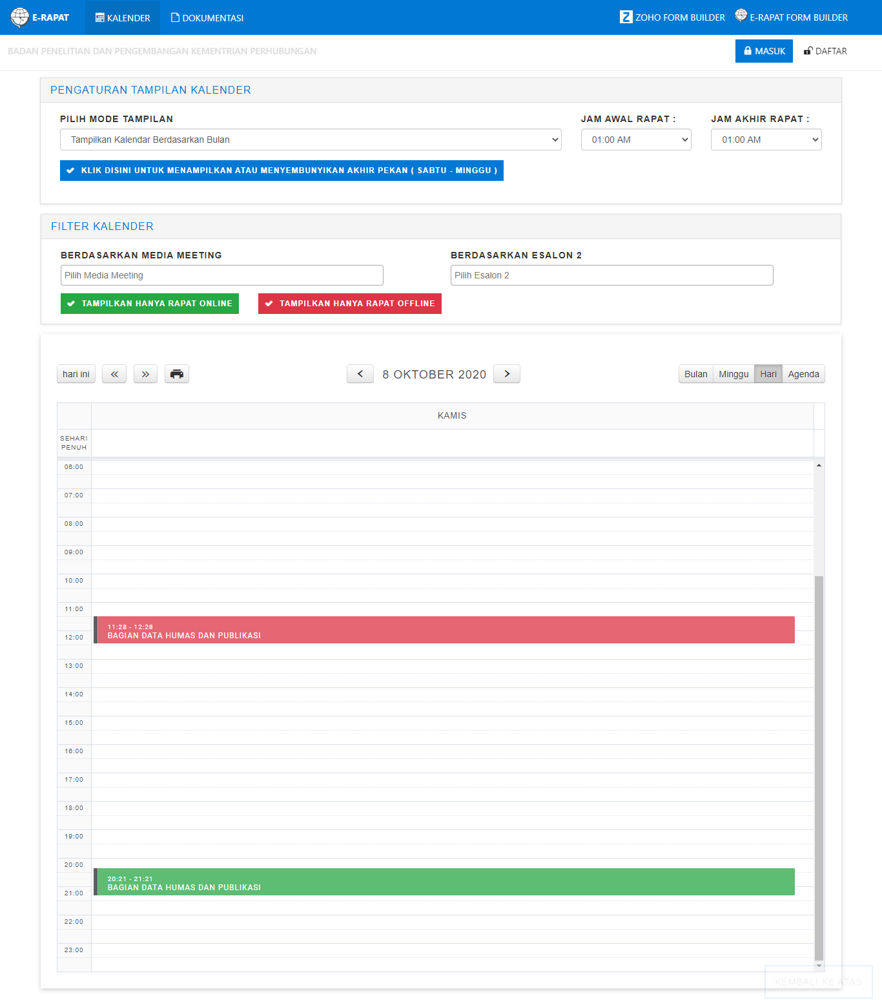
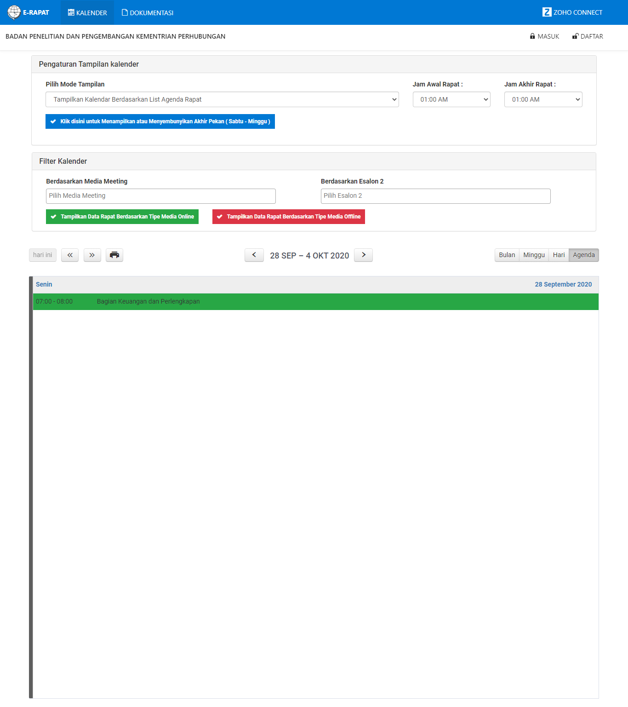

## E-RAPAT V2 (UPDATED Version)

### About

E-RAPAT V2 is an Application (UPDATED Version) for Meeting Administration in Research & Dev Center, Ministry of Transportation of Republic of Indonesia.
Now this application is `DEVELOPMENT PHASE`, Nowdays we still on progress Development.
This is became a portal or a center of the small services that connecting each other.
`This Documentation would be update regularly` Beacuse this Project is still On `DEVELOPMENT PHASE`

### Changelog

The following is the development version of `e-rapat application`

**Alpha Version 0.0.0** - September 2020

### The Screenshoot

Here is the screenshoot of the application.

